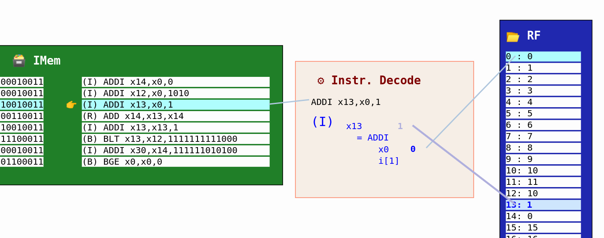

# Building a RISC-V CPU Core

Accompanying resources for the [Building a RISC-V CPU Core](https://www.edx.org/course/building-a-risc-v-cpu-core) [EdX](https://edx.org/) course by [Steve Hoover](https://www.linkedin.com/in/steve-hoover-a44b607/) of [Redwood EDA](https://redwoodeda.com), [Linux Foundation](https://www.linuxfoundation.org/), and [RISC-V International](https://riscv.org).

## Welcome

Congratulations for taking this step to expand your knowledge of computer hardware.

At this time, there are no course corrections or platform issues to report. Please do let us know within the EdX platform if anything gets in your way. There's a great deal of infrastructure to maintain for the course, and we aim to keep it all running smoothly. Now, back to EdX.

## RISC-V Starting-Point Code

To begin the first RISC-V lab, when instructed to do so, Ctrl-click this link to <a href="https://makerchip.com/sandbox?code_url=https:%2F%2Fraw.githubusercontent.com%2Fstevehoover%2FLF-Building-a-RISC-V-CPU-Core%2Fmaster%2Frisc-v_shell.tlv" target="_blank" atom_fix="_">open starting-point code in makerchip</a>.

## RISC-V Reference Solution

In case you get stuck, we've got your back! These <a href="https://makerchip.com/sandbox?code_url=https:%2F%2Fraw.githubusercontent.com%2Fstevehoover%2FLF-Building-a-RISC-V-CPU-Core%2Fmain%2Frisc-v_solutions.tlv" target="_blank" atom_fix="_">reference solutions</a> (Ctrl-click) will help with syntax, etc. without handing you the answers.

Here's a pre-built logic diagram of the final CPU. Ctrl-click here to [explore in its own tab](https://raw.githubusercontent.com/stevehoover/LF-Building-a-RISC-V-CPU-Core/main/lib/riscv.svg).

## Finished!

Congratulations!!!

After completing this course, we hope you are inspired to continue your journey. These ideas might help:
  - Try the tutorials in [Makerchip](https://makerchip.com).
  - Learn more about [TL-Verilog](https://redwoodeda.com/tl-verilog).
  - Explore the [RISC-V](https://riscv.org) ecosystem.
  - Take [other courses](https://training.linuxfoundation.org/full-catalog/) from [Linux Foundation](https://www.linuxfoundation.org/)
  - Discover [other training](https://www.redwoodeda.com/publications) from [Redwood EDA](https://redwoodeda.com)
  - Get your core running on real hardware using FPGAs [in the cloud](https://github.com/stevehoover/1st-CLaaS) or [on your desktop](https://github.com/shivanishah269/risc-v-core/).
  - Install [TL-Verilog tools](https://www.redwoodeda.com/products).
  - Learn about the [WARP-V](https://github.com/stevehoover/warp-v) TL-Verilog CPU core generator.